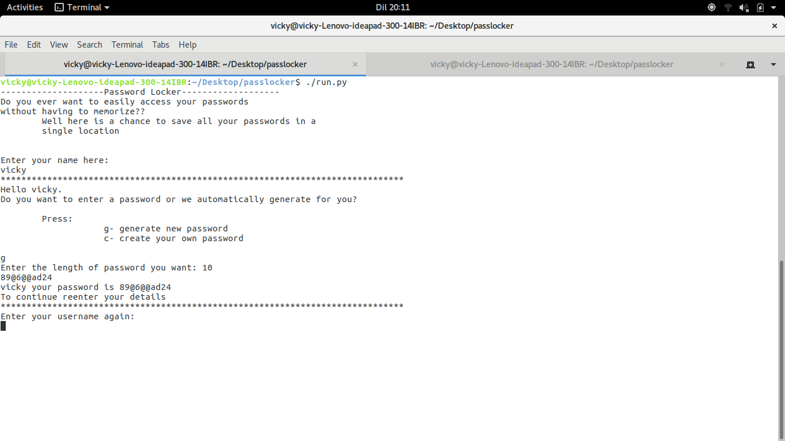

# PASSWORD LOCKER
#### Password locker is an application that allows you to store your account credentials v1.0.0
#### By ****Victoria Cherotich Mutai****

It allows you to login by either entering your password or generating the password. And gives you access to your stored credentials after logging in

## Installation
1. Open the (github repo)[https://github.com/VickyMutai/Password_locker]
2. Clone or download the files
3. Ensure python is installed on your machine
4. On the terminal for linux or command prompt for windows;
  * Open the containing folder.
  * Run ./run.py
5. Follow the instructions to add details.

## Requirements
* Browser
* Good internet connection
* For windows users;
&nbsp; &nbsp; &nbsp; &nbsp; GitBash
* For linux/ubuntu users
&nbsp; &nbsp; &nbsp; &nbsp; Git

## Technologies used

This is mainly a python application

## Meta

Email me at - [Victoria Mutai](vicky.mutai96@gmail.com)
 
Github - [VickyMutai](https://github.com/VickyMutai)

### License
This is an open source software therefore the license is [MIT](https://choosealicense.com/licenses/mit/)
 
Copyright (c) 2017 **Legacy Softwares**
